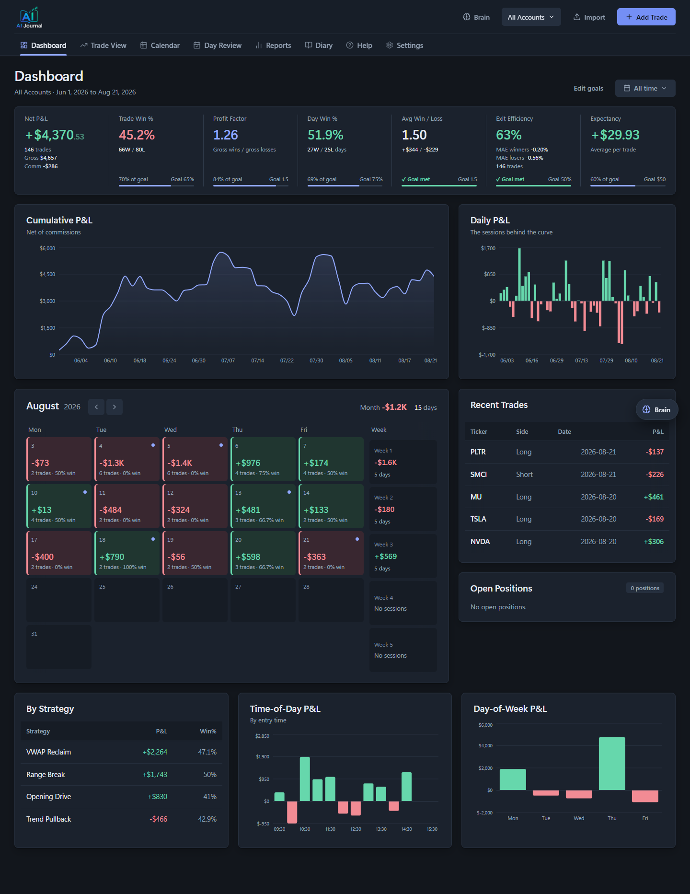
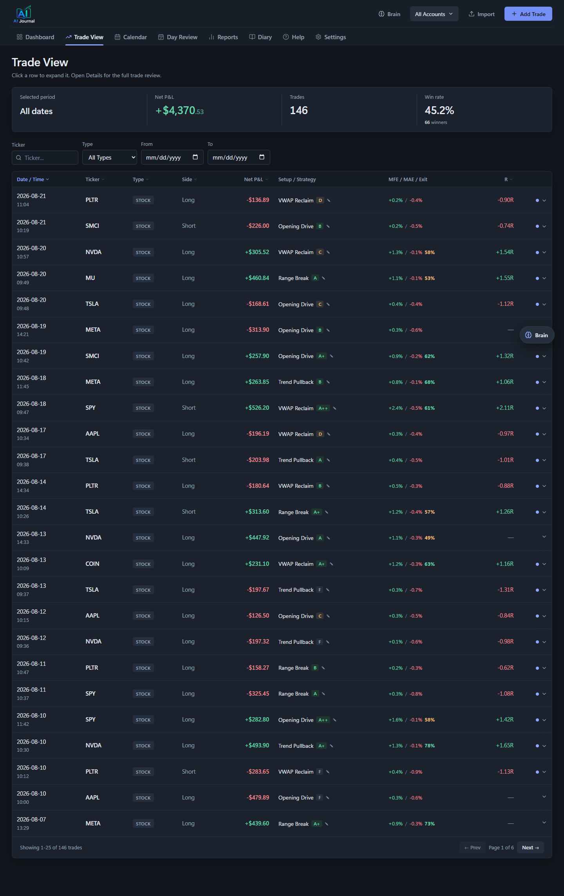
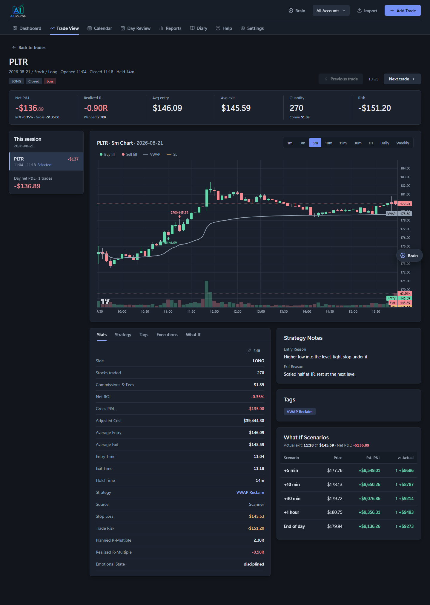
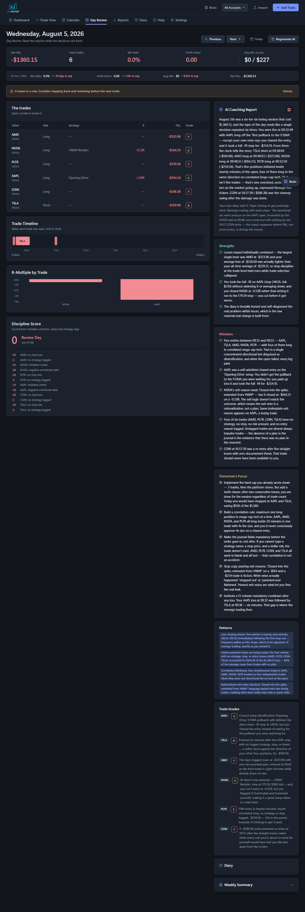
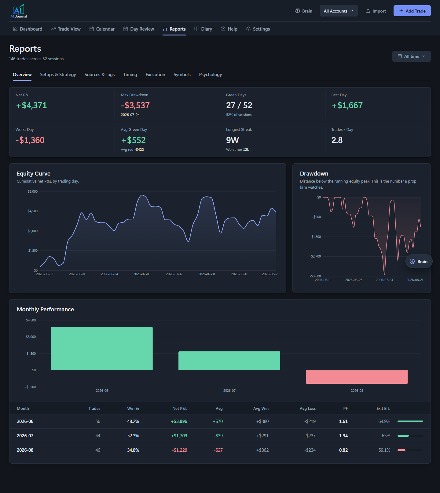
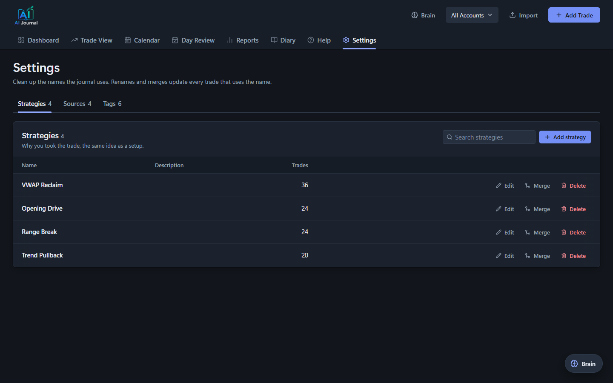

# Trading Journal AI

## Watch the walkthrough

[](https://www.youtube.com/watch?v=LTR4HOfS_hc)

A full tour of the app, an install from an empty folder, and three prompts that change it while
the camera is running. Every prompt used in the video is in the video description, ready to paste.

An AI-powered trading journal you run locally on your own machine. Import your broker's CSV, and the journal groups executions into round-trip trades, tracks your KPIs (win rate, profit factor, expectancy, drawdown, exit efficiency), and uses Claude to analyze your trading diary, grade your days, and answer questions about your own data.

This whole app was built by describing problems to Claude Code, one session at a time: "my spreadsheet can't group partial fills", "I want my handwritten diary matched to my trades", "show me when in the day I lose money". No web framework expertise required to get here, and none required to make it yours.

**What this is not:** Not financial advice. Not a signal service. Every screenshot below is the
synthetic demo seed, not anyone's real trades.



## What's inside

- **Dashboard**: P&L curve, KPIs against your goals, calendar heatmap, open positions and recent trades
- **Trade View**: every trade with executions, playbook setup tags, MFE/MAE and exit efficiency, expandable AI analysis and an intraday chart
- **Reports**: breakdowns by day of week, time of day, hold time, setup, grade, symbol, side, emotion,
  plus a Sources & Tags tab that scores where your ideas come from
- **Diary**: upload handwritten notes, screenshots, or typed text; Claude extracts strategy, stops, R-multiples, emotional state, and mistakes, and matches them to your actual trades
- **Day Review / Weekly Summary**: AI coaching reports graded on process, not just P&L
- **Brain**: a chat that answers questions against your full trading history
- **Settings**: the name library. Strategies, sources and tags in one place, with rename, merge and
  delete. Merging rewrites every trade that used the old name and remembers it, so the next diary
  analysis that produces the duplicate saves it under the name you kept
- **Import**: Thinkorswim account statement CSV and Interactive Brokers (IBKR) Activity Statement CSV, with a broker dropdown (auto-detect by default)

## Screenshots

**Trade View.** Every trade with its executions, MFE/MAE and exit efficiency, the realized R, and the
setup you tagged. Click a row to expand it in place, or open the full review.



**Trade Details.** The executions on one trade, the planned and realized R, the stop and target you
wrote before entry, and an intraday chart with your fills marked on it. Charts open on the trade
day's session; the legend entries switch layers on and off.



**Day Review.** An AI coaching report graded on process rather than P&L. It reads your trades and
your diary together, and it is willing to tell you a profitable day was badly run.



**Reports.** Equity curve, drawdown against the running peak, and breakdowns by setup, timing,
execution, symbol, source, tag and psychology.



**Settings.** The vocabulary the journal uses. Rename a strategy, merge two that mean the same thing,
or delete one and reassign its trades.



## Quick start

Requirements: Python 3.11+, Node 18+.

```bash
# 1. Python environment + backend dependencies
python -m venv .venv
.venv\Scripts\activate         # Windows (source .venv/bin/activate on Mac/Linux)
pip install -r backend/requirements.txt

# 2. Frontend dependencies
cd frontend
npm install
cd ..

# 3. Run both (Windows; launch.bat picks up .venv automatically)
launch.bat
```

`launch.bat` starts the FastAPI backend on http://localhost:8010 and the React frontend on http://localhost:3010. On Mac/Linux run them manually: `uvicorn main:app --reload --port 8010` from `backend/`, and `PORT=3010 npm start` from `frontend/`.

To run them on other ports, tell each side about the other: `REACT_APP_API_URL` for the frontend,
and `FRONTEND_ORIGINS` (comma separated) for the backend's CORS allow list.

This is a clean install: zero accounts, zero trades. Add your first account in the app, then import your broker's CSV or use `scripts/sample_import.csv` (Thinkorswim) or `scripts/sample_import_ibkr.csv` (Interactive Brokers) on the Import page to see the shape of an import (demo data, remove it after).

**Want to explore with realistic data first?** Run `python scripts/seed_demo.py` before `launch.bat` to seed 12 weeks of synthetic trades across 3 demo accounts. It's the same data the screenshots use. Delete `backend/trading_journal.db` afterward to reset to a clean install.

## Environment variables

Copy `.env.example` to `backend/.env` and fill in the keys yourself, or ask Claude Code to do it:

**Add your API keys:**

> Copy .env.example to backend/.env. Then ask me for my Anthropic API key, and after that my Alpaca key ID and secret key, one at a time. Write each one into the matching line in backend/.env exactly as I paste it. Do not print any of them back to me or log them anywhere else. When all three are in, tell me to restart launch.bat.

Everything is optional; the app runs without any keys and tells you exactly which feature each missing key disables.

| Variable | Enables |
|---|---|
| `ANTHROPIC_API_KEY` | Diary analysis, Day Review, Weekly Summary, Insights, and the Brain chat |
| `APCA_API_KEY_ID` / `APCA_API_SECRET_KEY` | Intraday price charts on each trade (free Alpaca account works) |
| `ALPACA_DATA_FEED` | Optional, defaults to `iex` (free-tier data). Set to `sip` only if your key has a paid market-data subscription. |
| `FRONTEND_ORIGINS` | Optional, defaults to `http://localhost:3010`. Comma-separated origins the backend accepts. |

## Make it yours with Claude Code

This repo is meant to be adapted, and the fastest way is to point Claude Code at it. A ready-to-paste prompt:

**Adapt the importer to your broker:**

> Read backend/csv_parser.py. It parses Thinkorswim account statement CSVs and Interactive Brokers Activity Statement CSVs: each broker parser reads execution rows (date, time, buy/sell, quantity, symbol, price, fees) into a common execution dict shape (action BOT/SOLD, qty, ticker, price, instrument_type, date, iso_date, time, amount, commission) and hands them to build_trades_from_executions, which groups them into round-trip trades by position open/close cycles and de-duplicates against the database. Here is a sample CSV export from my broker (pasted below / attached). Write a parse_<broker>_csv function for my broker's format following parse_ibkr_csv as the template, register it in BROKER_PARSERS and BROKER_LABELS, teach detect_broker to recognise the file, and add the broker to the BROKERS dropdown in frontend/src/components/Import.js with its export instructions. Keep the duplicate-detection fingerprints working.

## Who made this

Simon, a day trader. I built this because the journals I was paying for made me fill in forms hours
after the trade, and I never kept it up. I am not a programmer; this was built by describing problems
to Claude Code, and the prompts are in the video description.

- YouTube: [@tapetoedge](https://www.youtube.com/@tapetoedge), where I show what I build and how
- X: [@tapetoedge](https://x.com/tapetoedge)
- Newsletter: [tape-to-edge.beehiiv.com](https://tape-to-edge.beehiiv.com), a free community for
  traders sharing the tools we make and the strategies we run. One email a week. Nothing for sale.

I take no affiliate money from any broker or tool, and this app has no paid tier, no account and no
telemetry. If it is useful, fork it.

Educational content, not financial advice. I have no affiliate relationship with anything I show or
use, ever.

## License

MIT. See [LICENSE](LICENSE).
